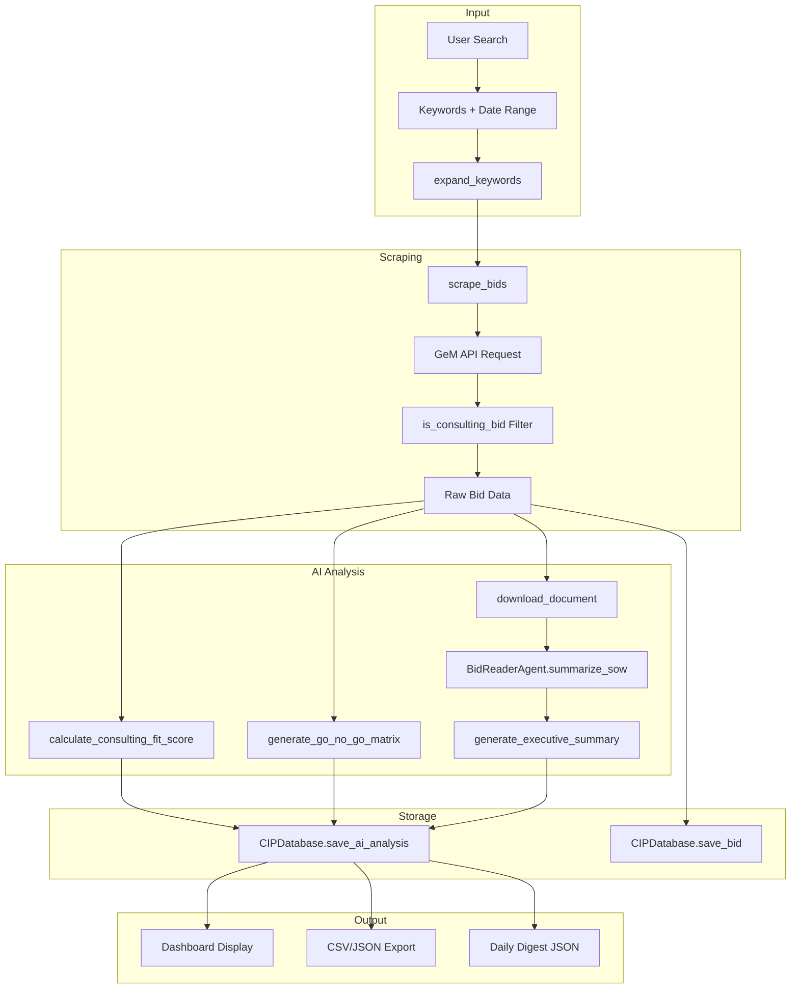

# Consulting Intelligence Platform (CIP)

## Complete Feature Documentation

---

## 🎯 Overview

The **Consulting Intelligence Platform (CIP)** is an AI-powered bid discovery and analysis tool designed for consulting firms (configured for EY Consulting). It scrapes government bids from the [GeM Portal](https://bidplus.gem.gov.in), filters for consulting opportunities, and uses **Gemini AI** to score and analyze each bid's fit with the firm's capabilities.

**Technology Stack:**

- **Frontend**: Streamlit (Python-based web UI)
- **AI Engine**: Google Gemini 2.5 Flash
- **Database**: SQLite (`cip_data.db`)
- **PDF Processing**: pdfplumber

---

## 📊 Core Features

### 1. Intelligence Dashboard

The main interface for discovering and analyzing bids.

| Feature | Description |
| --------- | ------------- |
| **Keyword Search** | Search by Items, Ministry, Department, or any free text |
| **Semantic Expansion** | Automatically expands keywords (e.g., "ERP" → "SAP", "Oracle", "Enterprise Resource Planning") |
| **Date Filtering** | Filter by bid end date range |
| **Multi-Page Scraping** | Scrapes up to 20 pages (~200 bids) from GeM API |
| **Consulting Filter** | Filters out goods/procurement bids, keeping only consulting opportunities |

### 2. AI Analysis (Gemini-Powered)

Every scraped bid can be analyzed by AI to provide:

| Component | Description |
| ----------- | ------------- |
| **CFS Score** | Consulting Fit Score (0-100) measuring alignment with firm capabilities |
| **Go/No-Go Matrix** | Traffic light indicators (🟢/🟡/🔴) for Eligibility, Timeline, Technical Fit |
| **Executive Summary** | "The Ask", Key Deliverables, Evaluation Criteria |
| **Reasoning** | AI explanation of why the bid does or doesn't fit |

**CFS Score Interpretation:**

- **80-100 (Strong Fit)**: Core expertise, high strategic value → **GO**
- **50-79 (Marginal Fit)**: Some alignment, worth considering → **MAYBE**
- **0-49 (Out of Scope)**: Goods, hardware, non-consulting → **NO-GO**

### 3. Virtual User (SOW Summary)

An intelligent document reader that extracts and summarizes the Scope of Work from bid PDFs.

| Step | Action |
| ------ | -------- |
| **PDF Scan** | Scans first 30 pages for "Scope of Work" section headers |
| **Boundary Detection** | Uses AI to identify SOW start/end pages |
| **Text Extraction** | Extracts text from identified range |
| **AI Summary** | Generates structured summary with requirements, quantities, qualifications |

### 4. Watchlist

Monitor important bids for changes.

| Feature | Description |
| --------- | ------------- |
| **Add/Remove** | One-click add from dashboard or remove from watchlist page |
| **Update Checking** | "Check for Updates" scans watched bids for date changes, corrigenda |
| **Change Logging** | All detected changes logged to database with timestamps |

### 5. Daily Scrape Results

View historical bid data from the database.

| Filter | Options |
| -------- | --------- |
| **Time Range** | Last 7, 15, 30, 90, 180, 365 days |
| **Run Now** | Manual trigger for fresh scrape |
| **View Mode** | Cards or Table |

### 6. Analytics

Statistical overview of scraped data.

| Metric | Description |
| -------- | ------------- |
| **Total Bids Scraped** | Count of all bids in database |
| **High-Fit Opportunities** | Bids with CFS ≥ 80 |
| **Pending Analysis** | Bids not yet analyzed by AI |
| **Category Breakdown** | Distribution across consulting categories |

### 7. Scheduler (Background Automation)

Automated, timed execution of tasks.

| Job | Schedule |
| ----- | ---------- |
| **Daily Intelligence Run** | 08:00 AM daily (configurable) |
| **Watchlist Check** | Every 6 hours |

**Output**: JSON digests saved to `digests/` folder.

### 8. Data Export

Export scraped data in multiple formats.

| Format | Contents |
| -------- | ---------- |
| **CSV** | Bid Number, Items, Department, Dates, Links |
| **JSON** | Full data including CFS scores, AI reasoning, executive summaries |

---

## 🗂️ Consulting Taxonomy

Bids are classified into 5 categories:

| Category | Examples |
| ---------- | ---------- |
| **Strategy & Policy** | DPR, Feasibility Study, Vision Document, Roadmap |
| **Tech & Digital** | ERP, Cloud Migration, AI/ML, Cybersecurity, E-Governance |
| **PMU / PMC** | Project Management Unit, Implementation Support, Manpower |
| **Audit & Finance** | Statutory Audit, Due Diligence, Financial Advisory |
| **HR & Capacity** | Training, Capacity Building, Change Management |

---

## 🛠️ Configuration

All settings are centralized in `config.py`:

| Config Block | Purpose |
| -------------- | --------- |
| `CONSULTING_TAXONOMY` | Keywords and filters for each consulting category |
| `FIRM_PROFILE` | Expertise areas, industries, tech stack (configured for EY) |
| `SCRAPING_CONFIG` | Max pages, rate limits, retry logic |
| `AI_CONFIG` | Model selection (`gemini-2.5-flash`), temperature, token limits |
| `SCHEDULER_CONFIG` | Daily run time, watchlist interval |
| `NOTIFICATION_CONFIG` | Digest format, minimum CFS threshold |
| `KEYWORD_EXPANSIONS` | Semantic synonyms for search terms |

---

## 📁 File Structure

```text
gem_scraper/
├── app.py                 # Streamlit UI (629 lines)
├── gem_scraper.py         # Core scraping logic (405 lines)
├── ai_analyzer.py         # Gemini AI integration (324 lines)
├── virtual_agent.py       # PDF reading agent (204 lines)
├── database.py            # SQLite storage (384 lines)
├── config.py              # All configuration (160 lines)
├── agent_scheduler.py     # Background job scheduler
├── cip_data.db            # SQLite database file
├── digests/               # Daily digest JSON files
├── downloads/             # Downloaded bid PDFs
├── .env                   # API keys (GOOGLE_API_KEY)
├── requirements.txt       # Python dependencies
├── README.md              # Installation guide
├── QUICK_START.md         # User quick-start guide
└── features.md            # Legacy feature list
```

---

## 🚀 Quick Start

1. **Install dependencies**: `pip install -r requirements.txt`
2. **Configure API key**: Add `GOOGLE_API_KEY=your_key` to `.env`
3. **Run application**: `python -m streamlit run app.py`
4. **Access**: Open [http://localhost:8501](http://localhost:8501)

---

## 📡 API & Data Sources

| Source | Endpoint |
| -------- | ---------- |
| **GeM Portal** | `https://bidplus.gem.gov.in/all-bids-data` (POST) |
| **AI Model** | `models/gemini-2.5-flash-preview-05-20` via Google GenAI |

---

## 🔄 Data Flow



### Data Flow Steps

| Step | Component | Input | Output |
| ------ | ----------- | ------- | -------- |
| 1 | `expand_keywords()` | User keyword (e.g. "ERP") | Expanded list ["ERP", "SAP", "Oracle", ...] |
| 2 | `scrape_bids()` | Keywords, dates, max_pages | List of raw bid dictionaries |
| 3 | `is_consulting_bid()` | Single bid dict | (True/False, Category name) |
| 4 | `calculate_consulting_fit_score()` | Bid data, firm profile | CFS score (0-100), verdict, reasoning |
| 5 | `generate_go_no_go_matrix()` | Bid data, SOW text | Traffic light flags per criterion |
| 6 | `BidReaderAgent.summarize_sow()` | PDF path | SOW summary dict |
| 7 | `CIPDatabase.save_bid()` | Bid dict | Stored in SQLite |
| 8 | `CIPDatabase.save_ai_analysis()` | Analysis results | Linked to bid in SQLite |

---

## 🔧 Functions Reference

### gem_scraper.py — Core Scraping

| Function | Purpose | Returns |
| ---------- | --------- | --------- |
| `get_csrf_token(session)` | Extracts CSRF token from GeM page | `str` token |
| `expand_keywords(keyword)` | Expands search term with synonyms | `List[str]` keywords |
| `is_consulting_bid(bid_data)` | Classifies bid using taxonomy | `Tuple[bool, str]` (is_consulting, category) |
| `scrape_bids(keywords, from_date, to_date, max_pages, consulting_only)` | Main scraper with pagination and filtering | `List[Dict]` bids |
| `download_document(url, save_dir, bid_data)` | Downloads bid PDF | `str` file path or `None` |
| `extract_text_from_pdf(pdf_path)` | Extracts all text from PDF | `str` full text |
| `extract_hyperlinks_from_pdf(pdf_path)` | Extracts URIs from PDF | `List[str]` URLs |

### ai_analyzer.py — AI Integration

| Function | Purpose | Returns |
| ---------- | --------- | --------- |
| `GeminiAnalyzer._call_gemini(prompt)` | Calls Gemini API with retry | `str` response text |
| `calculate_consulting_fit_score(bid_data, firm_profile)` | Computes CFS score | `Dict{score, verdict, reasoning}` |
| `generate_go_no_go_matrix(bid_data, sow_text, firm_profile)` | Evaluates bid criteria | `Dict{eligibility, timeline, technical_fit, ...}` |
| `generate_executive_summary(sow_text, bid_data)` | Creates structured summary | `Dict{the_ask, key_deliverables, evaluation_criteria}` |
| `analyze_bid_complete(bid_data, sow_text, pdf_path)` | Runs full AI pipeline | `Dict{cfs, go_no_go, summary}` |

### virtual_agent.py — PDF Reader Agent

| Method | Purpose | Returns |
| -------- | --------- | --------- |
| `BidReaderAgent.__init__(pdf_path)` | Initializes agent with PDF | Agent instance |
| `find_sow_boundary()` | Scans for SOW section boundaries | `Tuple[int, int]` (start_page, end_page) |
| `_is_sow_start(text)` | AI check if text starts SOW | `bool` |
| `_is_new_section(text)` | AI check if text is new section | `bool` |
| `extract_sow_text(start_page, end_page)` | Extracts text from range | `str` SOW text |
| `summarize_sow()` | Main method: find, extract, summarize | `Dict{summary, pages_found, ...}` |

### database.py — Data Storage

| Method | Purpose | Returns |
| -------- | --------- | --------- |
| `CIPDatabase.init_database()` | Creates tables if not exist | `None` |
| `save_bid(bid_data)` | Upserts bid record | `None` |
| `save_ai_analysis(analysis_data)` | Stores AI results linked to bid | `None` |
| `get_bid(bid_number)` | Retrieves single bid | `Dict` or `None` |
| `get_all_bids(limit)` | Gets recent bids | `List[Dict]` |
| `get_bid_with_analysis(bid_number)` | Joins bid + AI analysis | `Dict` |
| `get_recent_bids_with_analysis(limit)` | Bulk fetch with analysis | `List[Dict]` |
| `get_bids_in_period(days)` | Bids from last N days | `List[Dict]` |
| `add_to_watchlist(bid_number)` | Adds bid to watch | `None` |
| `remove_from_watchlist(bid_number)` | Removes bid from watch | `None` |
| `get_watchlist()` | All watched bid numbers | `List[str]` |
| `log_change(bid_number, change_type, old, new)` | Records detected change | `None` |
| `get_changes(bid_number, limit)` | Retrieves change history | `List[Dict]` |

---

## 📤 Output Formats

### Bid Data Structure

```json
{
  "Bid Number": "GEM/2025/B/1234567",
  "Items": "Consultancy Services for Digital Transformation",
  "Quantity": "1",
  "Department": "Ministry of Electronics and IT",
  "Start Date": "01-Dec-2025",
  "End Date": "31-Dec-2025",
  "Document Link": "https://bidplus.gem.gov.in/showbidDocument/...",
  "Category": "Tech & Digital"
}
```

### AI Analysis Output

```json
{
  "cfs_score": {
    "score": 85,
    "verdict": "GO",
    "reasoning": "Strong alignment with firm's digital transformation expertise..."
  },
  "go_no_go": {
    "eligibility": "GREEN",
    "timeline": "YELLOW",
    "technical_fit": "GREEN",
    "strategic_value": "GREEN",
    "risk_level": "YELLOW",
    "recommendation": "PURSUE",
    "notes": "Timeline is tight but manageable with dedicated team."
  },
  "executive_summary": {
    "the_ask": "End-to-end digital transformation of legacy systems",
    "key_deliverables": [
      "Current state assessment report",
      "Technology roadmap",
      "Implementation support"
    ],
    "evaluation_criteria": [
      "Past experience in similar projects",
      "Technical approach",
      "Team composition"
    ]
  }
}
```

### SOW Summary Output

```json
{
  "pages_scanned": 30,
  "sow_found": true,
  "sow_pages": [12, 18],
  "summary": {
    "scope_overview": "Implementation of enterprise resource planning system...",
    "key_requirements": ["Module development", "Data migration", "Training"],
    "quantities": {"Consultants": 5, "Duration": "12 months"},
    "qualifications_needed": ["ISO certification", "Prior government experience"]
  }
}
```

### Daily Digest Format

```json
{
  "date": "2025-12-21",
  "total_scraped": 45,
  "high_fit_count": 8,
  "categories": {
    "Tech & Digital": 20,
    "Strategy & Policy": 15,
    "PMU / PMC": 10
  },
  "top_opportunities": [
    {"bid_number": "GEM/2025/B/1234567", "cfs_score": 92}
  ]
}
```

---

## 🗄️ Database Schema

### Tables

| Table | Purpose |
| ------- | --------- |
| `bids` | Core bid metadata (number, items, dates, links) |
| `ai_analysis` | CFS score, Go/No-Go, summaries linked to bids |
| `watchlist` | Bid numbers being monitored |
| `change_log` | Historical changes detected in watched bids |

### Key Relationships

```text
bids.bid_number  ←──→  ai_analysis.bid_number (1:1)
bids.bid_number  ←──→  watchlist.bid_number (1:1)
bids.bid_number  ←──→  change_log.bid_number (1:N)
```

---

Last Updated: December 2025
